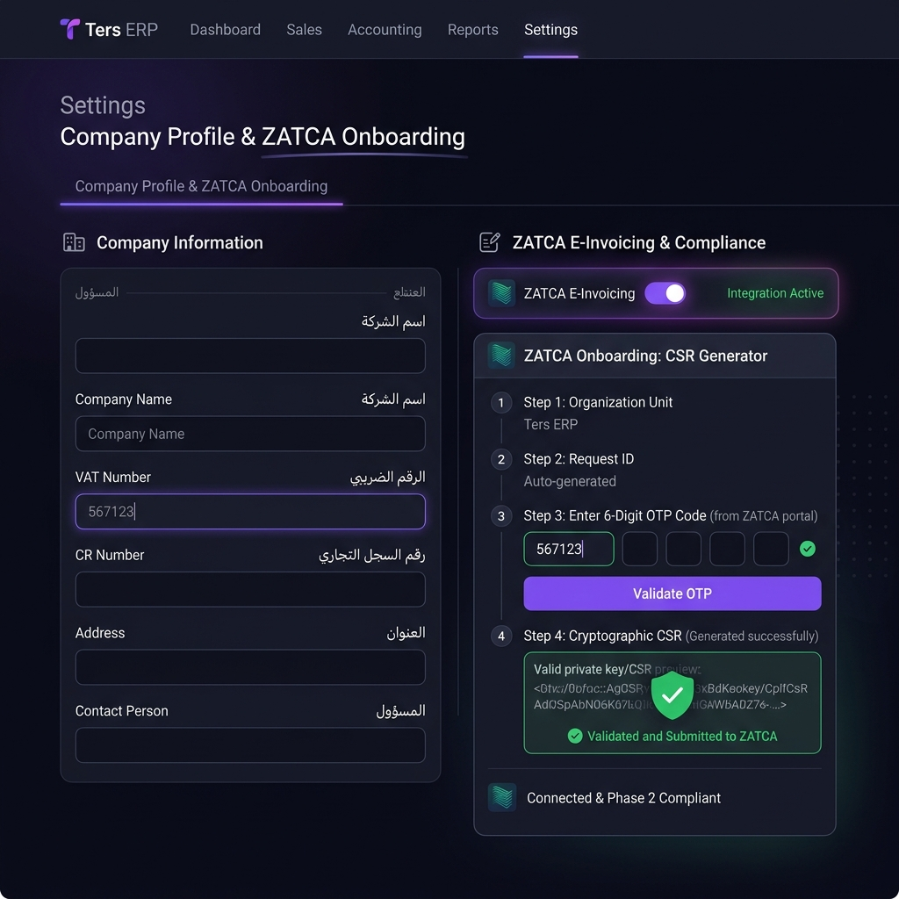

# Ters ERP | ترس المحاسبي
### Modern, Lightweight, Bilingual ERP Suite for SMEs
### نظام تخطيط موارد المؤسسات الحديث والمبتكر للمنشآت الصغيرة والمتوسطة





Ters ERP is a state-of-the-art, open-source Enterprise Resource Planning suite optimized for Small and Medium Enterprises (SMEs). Built with absolute bilingual isolation (Arabic & English), dynamic multi-tenancy (SaaS), and seamless database support, it provides high-performance double-entry financial controls with zero installation friction.

نظام **ترس المحاسبي** هو نظام متطور ومتكامل لتخطيط موارد المؤسسات (ERP)، مصمم خصيصاً لتلبية احتياجات المنشآت الصغيرة والمتوسطة. يتميز النظام بدعم كامل لعزل اللغتين (العربية والإنجليزية) بشكل نظيف، وتعدد المستأجرين (SaaS)، مع واجهات استخدام حديثة وأداء مالي دقيق قائم على مبادئ المحاسبة المزدوجة القياسية.

---

## 🌟 مميزات ترس المحاسبي | Features of Ters ERP

### 1. General Ledger & Double-Entry Accounting | المحاسبة العامة والقيود المزدوجة
* **Bilingual Chart of Accounts (دليل الحسابات الشجري)**: A dynamic, multi-level tree structure organizing Assets, Liabilities, Equity, Revenues, and Expenses.
* **Balanced Vouchers (القيود المحاسبية المزدوجة)**: Real-time balance safety verification (Debits must equal Credits) for manual and automated ledger entries.
* **Live Financial Statements (التقارير والقوائم الفورية)**: Generates instant **Income Statements (قائمة الدخل)**, **Balance Sheets (الميزانية العمومية)**, and **Trial Balances (ميزان المراجعة)** directly from posted transactions.

### 2. Sales & Accounts Receivable | المبيعات وفواتير العملاء
* **Customer Catalog (دليل العملاء)**: Dynamic profiles tracking transaction history, billing settings, and credit balances.
* **Automated Sales Invoicing (فواتير Mبيعات المؤتمتة)**: Create professional sales invoices that automatically calculate taxes, record sales, and post double-entry entries:
  * **Debit**: Customer Account (Receivable)
  * **Credit**: Revenue & Tax Accounts
* **Payment Tracking (متابعة التحصيلات)**: Easily record payments to clear outstanding customer balances in real-time.

### 3. Purchases & Accounts Payable | المشتريات وفواتير الموردين
* **Vendor Directory (دليل الموردين الكلي)**: Manage comprehensive vendor profiles, contact details, and payment histories.
* **Purchase Bills Integration (إدارة فواتير الشراء)**: Record vendor invoices to update stock levels and dynamically create double-entry ledger vouchers:
  * **Debit**: Inventory Assets or Expense Accounts
  * **Credit**: Vendor Account (Payable) & Input Tax
* **Payable Control (الرقابة الدائنة)**: Track outstanding payables, due dates, and record cash/bank disbursements to vendors.

### 4. Inventory & Dynamic Stock Control | إدارة المستودعات والمخزون الذكي
* **Product Catalog & SKU Tracking (دليل المنتجات والباركود)**: Centralized inventory catalog with dynamic pricing, SKUs, and category structures.
* **Automatic Stock Adjustment (التحكم التلقائي بالمخزون)**: Stock levels automatically adjust in real-time based on sales invoices and purchase bills.
* **Cost of Goods Sold - COGS (حساب تكلفة المبيعات)**: Real-time calculations of COGS upon posting sales invoices, ensuring accurate gross profit tracking on every financial statement.

### 5. HR Management & Automated Payroll | الموارد البشرية والرواتب الذكية
* **Employee Master Directory (سجل الموظفين الموحد)**: Digital profiles for staff, including salary structures, departments, and hiring data.
* **Smart Payroll Slip Generator (مسير الرواتب الذكي)**: Generate monthly pay slips with automated double-entry postings to reflect staff expenses and liabilities:
  * **Debit**: Salary and Wage Expenses
  * **Credit**: Accrued Payroll Liabilities or Cash/Bank Accounts
* **Attendance and Pay Cycles (دورات الدفع والرواتب)**: Standardized accounting periods for smooth monthly closing.

---

## 💻 Tech Stack | التقنيات المستخدمة

* **Backend (الخلفية):** .NET 9.0 Core Web API, Entity Framework Core, SQLite (for dynamic local trial) & PostgreSQL (for production Enterprise SaaS).
* **Frontend (الواجهة):** React (TypeScript), Vite, Tailwind CSS / Vanilla CSS, Lucide Icons.
* **Deployment (التوزيع):** Wix Toolset v4/v5 standalone Windows MSI installer, silent background Windows Service (`TersERP`), and native C# silent GUI launcher.

---

## 🚀 Setup & Installation | خطوات التشغيل والتنصيب

### Prerequisites | المتطلبات الأساسية
* [.NET 9.0 SDK](https://dotnet.microsoft.com/download)
* [Node.js (v18+)](https://nodejs.org/)
* [PostgreSQL Database Server](https://www.postgresql.org/)

### 1. Run the Backend | تشغيل النظام الخلفي
Configure your database connection string in [appsettings.json](file:///c:/dotnetproject/ters-erp/src/TersErp.Api/appsettings.json) and run:
```bash
cd src/TersErp.Api
dotnet ef database update
dotnet run --no-launch-profile
```

### 2. Run the Frontend Client | تشغيل النظام الأمامي
```bash
cd src/terserp.client
npm install
npm run dev
```

---

## 📚 Documentation & Advanced Guides | المستندات والأدلة المتقدمة

* **[ZATCA E-Invoicing Integration Guide | دليل إعداد الفاتورة الإلكترونية](docs/zatca_setup.md)**: Step-by-step setup guide for ZATCA Phase 1 & 2 integration, CSR generation, and onboarding.
* **[Custom Domain & Reverse Proxy Setup Guide](docs/reverse_proxy_setup.md)**: A complete step-by-step guide with ready-to-use IIS and Nginx scripts to bind your local Ters ERP service to a custom domain (e.g., `https://ters-erp.yourdomain.com`).
* **[دليل إعداد النطاق المخصص والخادم الوكيل العكسي](docs/reverse_proxy_setup.md)**: دليل إعداد خطوة بخطوة باللغة الإنجليزية مع السكربتات البرمجية الجاهزة لخوادم IIS و Nginx لربط خادم نظام ترس المحاسبي بنطاق مخصص لشركتك.

---

## 🤝 Contributing | المساهمة في المشروع

Ters ERP is an open-source project, and we welcome contributions from developers, accountants, translators, and designers worldwide! 

نظام **ترس المحاسبي** هو مشروع مفتوح المصدر بالكامل، ونرحب بمساهمات المطورين، المحاسبين، المترجمين، والمصممين من جميع أنحاء العالم للارتقاء بالنظام!

### How to Contribute | كيف يمكنك المساهمة؟
1. **Fork the repository** and create your branch from `main`.
   قم بعمل **Fork** للمستودع وأنشئ فرعك الخاص (Branch) من الفرع الرئيسي `main`.
2. **Submit a Pull Request (PR)** with clear documentation of your changes or features.
   قم بتقديم طلب دمج **(Pull Request)** يوضح التغييرات أو الميزات الجديدة المضافة بالتفصيل.
3. **Report bugs & suggest features** by opening a GitHub Issue.
   قم بالإبلاغ عن الأخطاء أو تقديم اقتراحات لميزات جديدة عبر فتح **Issue** على جيت هب.

---

## 📄 License | الرخصة
This project is open-source under the **MIT License**.
جميع الحقوق مفتوحة ومتاحة للاستخدام والتطوير تحت رخصة **MIT**.

---

> Built with ❤️ in 🇸🇦 | بُني بحب ❤️ في 🇸🇦
