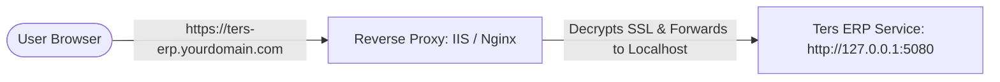

# Custom Domain & Reverse Proxy Setup Guide (Option 2)

This guide details the architectural steps and provides ready-to-use configuration scripts to bind a custom domain (e.g., `https://ters-erp.yourdomain.com`) to your locally installed **Ters ERP Windows Service** using either **IIS** or **Nginx** as a reverse proxy.

---

## 🌐 Network Architecture



---

## 🛠️ Option A: Setting Up with Microsoft IIS (Internet Information Services)

IIS is natively built into Windows, making it the preferred choice for native Windows Server deployments.

### Prerequisites
1. **Application Request Routing (ARR 3.0)** must be installed. [Download ARR 3.0](https://www.iis.net/downloads/microsoft/application-request-routing).
2. **URL Rewrite 2.1** must be installed. [Download URL Rewrite](https://www.iis.net/downloads/microsoft/url-rewrite).
3. Open IIS Manager, click on the Server Node, open **Application Request Routing Cache**, click **Server Settings** on the right, and check **Enable proxy**.

### Configuration Steps
1. Create a new Website in IIS (e.g., `TersErpProxy`).
2. Set the physical path to a blank folder (e.g., `C:\inetpub\TersErpProxy`).
3. Configure the binding with your hostname `ters-erp.yourdomain.com` and assign your SSL certificate.
4. Place the following `web.config` script inside the folder `C:\inetpub\TersErpProxy\web.config`.

#### 📄 IIS web.config Script

```xml
<?xml version="1.0" encoding="utf-8"?>
<configuration>
  <system.webServer>
    <rewrite>
      <rules>
        <rule name="Ters ERP Reverse Proxy" stopProcessing="true">
          <match url="(.*)" />
          <conditions>
            <!-- Automatically redirects HTTP to HTTPS -->
            <add input="{HTTPS}" pattern="off" ignoreCase="true" />
          </conditions>
          <!-- Replace 5080 with the active dynamic port if customized -->
          <action type="Rewrite" url="http://127.0.0.1:5080/{R:1}" />
        </rule>
        
        <rule name="Ters ERP Reverse Proxy HTTPS" stopProcessing="true">
          <match url="(.*)" />
          <conditions>
            <add input="{HTTPS}" pattern="on" ignoreCase="true" />
          </conditions>
          <action type="Rewrite" url="http://127.0.0.1:5080/{R:1}" />
        </rule>
      </rules>
      <outboundRules>
        <!-- Retain Host Header and resolve reverse mapping -->
        <rule name="Restore Host Header" preCondition="ResponseIsHtml">
          <match filterByTags="A, Area, Base, Form, Frame, Head, IFrame, Img, Link, Script" pattern="^http(s)?://127.0.0.1:5080/(.*)" />
          <action type="Rewrite" value="http{R:1}://ters-erp.yourdomain.com/{R:2}" />
        </rule>
        <preConditions>
          <preCondition name="ResponseIsHtml">
            <add input="{RESPONSE_CONTENT_TYPE}" pattern="^text/html" />
          </preCondition>
        </preConditions>
      </outboundRules>
    </rewrite>
    <security>
      <requestFiltering>
        <!-- Support large file uploads (up to 100MB) -->
        <requestLimits maxAllowedContentLength="104857600" />
      </requestFiltering>
    </security>
  </system.webServer>
</configuration>
```

---

## ⚡ Option B: Setting Up with Nginx

Nginx is extremely lightweight, blazing fast, and popular for running reverse proxies on Windows and Linux.

### Configuration Steps
1. Install Nginx for Windows.
2. Place your SSL certificate files (e.g., `ters_erp.crt` and `ters_erp.key`) in the `nginx/conf/ssl/` directory.
3. Replace the contents of your `nginx/conf/nginx.conf` file with the following configuration:

#### 📄 nginx.conf Script

```nginx
# Nginx Reverse Proxy Configuration for Ters ERP
worker_processes  1;

events {
    worker_connections  1024;
}

http {
    include       mime.types;
    default_type  application/octet-stream;
    sendfile        on;
    keepalive_timeout  65;

    # Gzip Compression for maximum frontend loading speed
    gzip on;
    gzip_types text/plain text/css application/json application/javascript text/xml;

    # 1. HTTP Redirection Rule to HTTPS
    server {
        listen       80;
        server_name  ters-erp.yourdomain.com;
        return 301 https://$host$request_uri;
    }

    # 2. Secure HTTPS Server Rule
    server {
        listen       443 ssl;
        server_name  ters-erp.yourdomain.com;

        # SSL Certificates
        ssl_certificate      ssl/ters_erp.crt;
        ssl_certificate_key  ssl/ters_erp.key;

        ssl_session_cache    shared:SSL:1m;
        ssl_session_timeout  5m;

        ssl_ciphers  HIGH:!aNULL:!MD5;
        ssl_prefer_server_ciphers  on;

        # Max payload size for ERP document attachments
        client_max_body_size 100M;

        location / {
            # Forward traffic to the local Windows Service active port
            proxy_pass http://127.0.0.1:5080;
            
            # Forward authentic client Headers
            proxy_set_header Host $host;
            proxy_set_header X-Real-IP $remote_addr;
            proxy_set_header X-Forwarded-For $proxy_add_x_forwarded_for;
            proxy_set_header X-Forwarded-Proto $scheme;

            # Enable WebSockets support (critical for EF Core signal/live notifications)
            proxy_http_version 1.1;
            proxy_set_header Upgrade $http_upgrade;
            proxy_set_header Connection "upgrade";
            
            # Timeouts
            proxy_connect_timeout 90;
            proxy_send_timeout 90;
            proxy_read_timeout 90;
        }
    }
}
```

---

## 🚀 Verification & Post-Configuration

After starting your chosen reverse proxy (IIS or Nginx):

1. **Hosts File Check**: Update `C:\Windows\System32\drivers\etc\hosts` locally on test machines:
   ```text
   127.0.0.1    ters-erp.yourdomain.com
   ```
2. **Setup Custom Hostname**: Add `"CustomHostName": "https://ters-erp.yourdomain.com"` to `C:\ProgramData\TersERP\appsettings.custom.json`.
3. **Launch**: Click the desktop or start-menu shortcut. Our native **`TersErp.Launcher.exe`** will immediately detect the custom hostname config, bypass the local dynamic port, and cleanly boot your browser straight to your secure custom domain!
